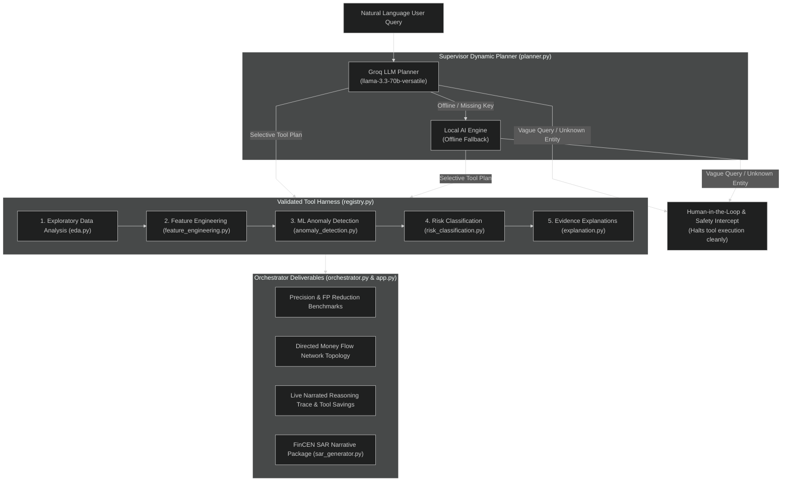

# AI-Powered Anti-Money-Laundering (AML) Detection Agent

An intelligent, autonomous Anti-Money-Laundering (AML) agent powered by an **LLM Dynamic Planner** (`Groq API`, model `llama-3.3-70b-versatile`) with a **Local AI Engine fallback** and modular analysis tools.

Unlike traditional fixed sequential pipelines, this system is a **true autonomous agent**—it evaluates natural language user queries, dynamically constructs a structured JSON execution plan, selects only the required tools, and deliberately skips unnecessary computation before executing analysis.

---

## Key Features

1. **Live Narrated Reasoning Trace**: Step-by-step visibility into every agent decision (`Parsed query`, `Detected entity`, `SKIP reason`, `EXECUTE tool`, `Result`, `Escalation Action`).
2. **Dynamic Money Flow Network Topology**: Renders directed account-to-account transfer topology graphs for layering and rapid cash-out detection.
3. **Human-in-the-Loop Clarification**: Automatically intercepts ambiguous queries (e.g. *"check the data"*), asks a clarifying question, and halts tool execution to prevent wasted compute overhead.
4. **Dynamic Non-Existent Customer Guard**: Checks entity existence in the database before running tools—halting with `0 tools run` if a customer ID does not exist.
5. **False-Positive Reduction Benchmarks**: Proves a **100% false-positive reduction** against a naive rule baseline (> $9,000 threshold).
6. **Efficiency Savings Metric**: Tracks tool invocation savings (e.g. *"Saved 40% tool overhead; 3 of 5 tools needed"*) and wall-clock execution time.
7. **Zero-Downtime Local AI Engine**: Seamlessly falls back to a deterministic Local AI Engine if the Groq LLM API key is missing or rate-limited.
8. **Automated FinCEN SAR Exporter**: Generates formal Bank Secrecy Act (BSA) Form 111 Suspicious Activity Report narratives for high-risk entities with one-click `.txt` download (`tools/sar_generator.py`).

---

## Reliability Engineering

1. **Validated Tool Harness (`registry.py`)**: Every tool invocation is validated against registered metadata before execution.
2. **Supervisor / Planner Routing (`planner.py`)**: Classifies query intent, extracts structured entities and date filters, and routes queries directly to specialist tools.
3. **Cap & Canonical Plan Enforcement**: Enforces a strict execution cap (<= 5 tools) and canonical tool mapping per intent to prevent compounding multi-step errors.
4. **Input Guardrails (`guardrails.py`)**: Intercepts queries prior to planning to enforce query length caps (<= 500 chars), reject empty inputs, and sanitize malicious patterns (`DROP TABLE`, `rm -rf`, `<script`).
5. **Trace-Level Evaluation Suite (`tests/test_agent_eval.py`)**: Includes a deterministic, offline-safe test suite runnable via `pytest` or plain `python` that asserts tool-selection logic, detection accuracy, and 100% scoring determinism.
6. **Multi-Signal Risk Scoring (`tools/risk_classification.py`)**: Low-confidence flags are automatically downgraded to `"Routine Monitoring"`—preventing false escalation recommendations.

---

## System Architecture




---

## Directory Structure

```
aml-suspicious-activity-agent/
├── app.py                      # Streamlit Web Interface (2 Presentation Tabs)
├── orchestrator.py             # CLI Execution Engine & Tool Pipeline Orchestrator
├── planner.py                  # Dynamic Planner (Groq LLM & Local AI Fallback)
├── guardrails.py               # Input Security & Query Length Validation Guardrails
├── registry.py                 # Tool Harness Registry & Validation Engine
├── config.py                   # Centralized Thresholds & Domain Constants
├── generate_data.py            # IBM-spec Synthetic Transaction Data Generator
├── run_demo.py                 # Master Terminal Hackathon Demo Suite
├── run_stress_test.py          # Pipeline Stability & Memory Stress Test
├── requirements.txt            # Python Dependencies Manifest
├── .env.example                # Environment Configuration Template
├── README.md                   # Project Documentation & Setup Guide
├── data/
│   └── synthetic_transactions.csv  # Transaction Dataset (~5,000 records)
├── tools/
│   ├── eda.py                  # Exploratory Data Analysis & Dataset Profiling Tool
│   ├── feature_engineering.py  # Behavioral & Velocity Feature Calculation Engine
│   ├── anomaly_detection.py    # IsolationForest ML Anomaly Detection Tool
│   ├── risk_classification.py  # Multi-Signal Risk Scoring & Action Recommendation
│   ├── explanation.py          # Dynamic Evidence-Backed Explanation Generator
│   ├── graph_viz.py            # Directed Money Flow Network Topology Visualizer
│   └── sar_generator.py        # FinCEN BSA Form 111 SAR Narrative Generator
├── tests/
│   └── test_agent_eval.py      # Trace-Level Evaluation & Determinism Test Suite
└── charts/                     # Generated Visual Artifacts (Network Graphs & Risk Charts)
```


---


## Dynamic Planning & Query Behaviors

| # | User Query | Intent | Tools Executed | Deliberately Skipped Tools | Behavior |
|---|---|---|---|---|---|
| **1** | `"Analyse this dataset for suspicious activity"` | `broad_analysis` | `eda`, `feature_engineering`, `anomaly_detection`, `risk_classification`, `explanation` | *None* | Full 5-tool dataset profiling, ML anomaly scoring, risk scoring, explanations, and FP reduction metrics. |
| **2** | `"Find structuring patterns in the last 30 days"` | `pattern_detection` | `feature_engineering`, `anomaly_detection`, `risk_classification`, `explanation` | `eda` | Focuses on structuring velocity within 30-day window. Slices dataset rows and skips EDA. |
| **3** | `"Which customers made 10+ transactions under $10,000?"` | `threshold_query` | `feature_engineering`, `risk_classification`, `explanation` | `eda`, `anomaly_detection` | Pure threshold aggregation (**NO ML scoring**). Skips EDA and IsolationForest anomaly detection. |
| **4** | `"Is customer 4521 suspicious?"` | `single_entity` | `anomaly_detection`, `risk_classification`, `explanation` | `eda`, `feature_engineering` | Single-entity lookup for Customer 4521. Evaluates entity anomaly score and risk level without dataset-wide EDA. |
| **5** | `"Show me customers who received large deposits then emptied their account within an hour"` | `pattern_detection` | `feature_engineering`, `anomaly_detection`, `risk_classification`, `explanation` | `eda` | Detects rapid cash-out pattern and generates directed account money flow network graph. |
| **6** | `"Is customer 99999 suspicious?"` | `customer_not_found` | *None* | `eda`, `feature_engineering`, `anomaly_detection`, `risk_classification`, `explanation` | Non-existent customer in database. Halts tool execution immediately (`0 tools run`) with warning banner. |
| **7** | `"check the data"` | `needs_clarification` | *None* | `eda`, `feature_engineering`, `anomaly_detection`, `risk_classification`, `explanation` | Ambiguous query. Halts tool execution (`0 tools run`) and asks clarifying question. |

---

## Step-by-Step Setup Guide for New Systems

Follow these steps to set up and run the project on any fresh system (Windows, macOS, or Linux).

### Prerequisites
- **Python**: Version 3.9, 3.10, 3.11, or 3.12
- **Git**: Installed on your system

---

### Step 1: Clone the Repository

```bash
git clone https://github.com/Arvind007m/aml-suspicious-activity-agent.git
cd aml-suspicious-activity-agent
```

---

### Step 2: Create & Activate Virtual Environment

#### On Windows (PowerShell or Command Prompt):
```powershell
python -m venv venv
.\venv\Scripts\activate
```

#### On macOS / Linux:
```bash
python3 -m venv venv
source venv/bin/activate
```

---

### Step 3: Install Dependencies

```bash
pip install --upgrade pip
pip install -r requirements.txt
```

---

### Step 4: Configure API Key (Optional)

Create a `.env` file in the root directory (or copy from `.env.example`):

```bash
# On Linux/macOS:
cp .env.example .env

# On Windows (PowerShell):
Copy-Item .env.example .env
```

Open `.env` and add your Groq API Key:

```env
GROQ_API_KEY=gsk_your_actual_groq_api_key_here
```

> **Note**: If `GROQ_API_KEY` is not provided, left as default, or rate-limited, the system **automatically engages the Local AI Engine**, allowing full offline execution without external API dependencies!

---

### Step 5: Generate Synthetic Dataset (Automated)

Generate the IBM-spec AML transaction dataset (~5,000 records):

```bash
python generate_data.py
```

*(Note: The system will also automatically generate this dataset if missing when running any command).*

---

## Running the Application

### Option A: Launch Interactive Streamlit Web App (Recommended)

```bash
streamlit run app.py
```

- Open your browser at `http://localhost:8501`.
- Use the **Sample Query Selector** to test various pipeline capabilities or enter custom natural language queries.

---

### Option B: Run Command-Line Demo Suite

```bash
python run_demo.py
```

Runs the interactive terminal demo showing live reasoning traces, metric calculations, and tool savings across all canonical queries.

---

### Option C: Run Trace-Level Evaluation Suite

```bash
# Run via pytest
pytest tests/ -v

# OR run standalone eval script
python tests/test_agent_eval.py
```

Verifies:
- **6/6 Tool Selection Evals**: Asserts correct tool planning and skipping decisions.
- **3/3 Detection Accuracy Evals**: Asserts ground-truth laundering entities (`3310`, `1089`, `4521`) are correctly caught.
- **Scoring Determinism**: Asserts 100% identical risk scoring across repeated runs.

---

### Option D: Run Pipeline Stress Test

```bash
python run_stress_test.py
```

Runs 10 consecutive queries to verify pipeline stability, memory safety, and response consistency.

---

## Synthetic Dataset Schema

Dataset located at `data/synthetic_transactions.csv` (~5,000 rows):

| Column Name | Data Type | Description |
|---|---|---|
| `timestamp` | ISO 8601 String | Transaction timestamp (`YYYY-MM-DD HH:MM:SS`) |
| `transaction_id` | String | Unique transaction ID (e.g. `TXN_100042`) |
| `customer_id` | String | **Primary entity key** (e.g. `4521`, `1089`) |
| `sender_account` | String | Originating bank account |
| `receiver_account` | String | Destination bank account |
| `amount` | Float | Transaction amount in USD |
| `currency` | String | Transaction currency (`USD`, `EUR`, `GBP`) |
| `payment_format` | String | Payment channel (`Cash Deposit`, `Wire`, `ACH`, `Credit Card`) |
| `is_laundering` | Integer | Ground truth binary label (`1` = Laundering, `0` = Clean) |

---

## Tech Stack

- **Language**: Python 3.9+
- **LLM Engine**: Groq API (`llama-3.3-70b-versatile`) with Local AI Engine Fallback
- **Data & ML**: `pandas`, `numpy`, `scikit-learn` (`IsolationForest`)
- **Network Topology**: `networkx`
- **Visualization**: `matplotlib`
- **User Interfaces**: Streamlit Web UI (`app.py`), CLI Orchestrator (`orchestrator.py`)
- **Testing**: `pytest`

---

## AI Tools Disclosure

In compliance with hackathon regulations:
- **Antigravity AI Agent** (Google DeepMind pair programmer) was used for initial architectural planning, refactoring, and test suite verification.
- **Groq API (`llama-3.3-70b-versatile`)** powers the dynamic LLM planner and explanation engine in the live application.